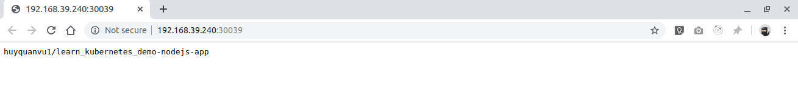

# Simple Microservices on Kubernetes

A simple microservices aplication support multiple Nodejs, Golang, Python (FastAPI/Flask) app as the nodes.

## Dockerize apps

First, we Dockerizing our Nodejs, Golang, Python application.

#### Dockerize Nodejs app

In mycase, I store my docker images in my docker hub: https://hub.docker.com/u/huyquanvu1

```
cd demo-nodejs-app
docker build -t huyquanvu1/learn-kubernetes-demo-nodejs-app .

# Test it on port 8001
docker run -p 8001:8080 huyquanvu1/learn-kubernetes-demo-nodejs-app

# Open: http://localhost:8001
# Result: huyquanvu1/learn-kubernetes-demo-nodejs-app

# Push image to docker hub
docker push huyquanvu1/learn-kubernetes-demo-nodejs-app
```

#### Dockerize Golang app

```
cd demo-golang-app
go build
docker build -t huyquanvu1/learn-kubernetes-demo-golang-app .

# Test it on port 8002
docker run -p 8002:8080 huyquanvu1/learn-kubernetes-demo-golang-app

# Open: http://localhost:8002
# Result: huyquanvu1/learn-kubernetes-demo-golang-app

# Push image to docker hub
docker push huyquanvu1/learn-kubernetes-demo-golang-app
```

#### Dockerize Python/Flask app

```
cd demo-python-flask-app
docker build -t huyquanvu1/learn-kubernetes-demo-python-flask-app .

# Test it on port 8003
docker run -p 8003:5000 huyquanvu1/learn-kubernetes-demo-python-flask-app

# Open: http://localhost:8003
# Result: huyquanvu1/learn-kubernetes-demo-python-flask-app

# Push image to docker hub
docker push huyquanvu1/learn-kubernetes-demo-python-flask-app
```

#### Dockerize Python/FastAPI app

```
cd demo-python-fastapi-app
docker build -t huyquanvu1/learn-kubernetes-demo-python-fastapi-app .

# Test it on port 8004
docker run -p 8004:80 huyquanvu1/learn-kubernetes-demo-python-fastapi-app

# Open: http://localhost:8004
# Result: huyquanvu1/learn-kubernetes-demo-python-fastapi-app

# Push image to docker hub
docker push huyquanvu1/learn-kubernetes-demo-python-fastapi-app
```

## Create Microservice with Kubernetes

Next, we use kubernetes to exposed our application which is Dockerized above as the services.

#### Expose Nodejs app as a service

```shell
# Clear demo-nodejs-node deployments, services
kubectl delete deployment demo-nodejs-node
kubectl delete service demo-nodejs-node

# Create deployment and expose service
kubectl create deployment demo-nodejs-node --image=huyquanvu1/learn-kubernetes-demo-nodejs-app
kubectl get deployments

# Exposes deployment as a service
kubectl expose deployment demo-nodejs-node --type=LoadBalancer --port=8080
kubectl get services

# Local test
minikube service demo-nodejs-node
```

#### Expose Golang app as a service

```shell
# Clear demo-golang-node deployments, services
kubectl delete deployment demo-golang-node
kubectl delete service demo-golang-node

# Create deployment and expose service
kubectl create deployment demo-golang-node --image=huyquanvu1/learn-kubernetes-demo-golang-app
kubectl get deployments

# Exposes deployment as a service
kubectl expose deployment demo-golang-node --type=LoadBalancer --port=8080
kubectl get services

# Local test
minikube service demo-golang-node
```

#### Expose Python/FastAPI app as a service

```shell
# Clear demo-python-fastapi-node deployments, services
kubectl delete deployment demo-python-fastapi-node
kubectl delete service demo-python-fastapi-node

# Create deployment and expose service
kubectl create deployment demo-python-fastapi-node --image=huyquanvu1/learn-kubernetes-demo-python-fastapi-app
kubectl get deployments

# Exposes deployment as a service
# FastAPI use default port 80
kubectl expose deployment demo-python-fastapi-node --type=LoadBalancer --port=80
kubectl get services

# Local test
minikube service demo-python-fastapi-node
```

#### Expose Python/Flask app as a service

```shell
# Clear demo-python-flask-node deployments, services
kubectl delete deployment demo-python-flask-node
kubectl delete service demo-python-flask-node

# Create deployment and expose service
kubectl create deployment demo-python-flask-node --image=huyquanvu1/learn-kubernetes-demo-python-flask-app
kubectl get deployments

# Exposes deployment as a service
# FastAPI use default port 80
kubectl expose deployment demo-python-flask-node --type=LoadBalancer --port=5000
kubectl get services

# Local test
minikube service demo-python-flask-node
```

## Result

Kubernetes Dashboard


Nodejs node



Golang node


Python/Flask node


Python/FastAPI node


Enjoy it!