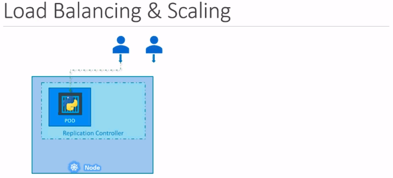

# Replicaset definition

ReplicaSet is a new version of Replication Controller.



Kubernetes create ReplicaSet

```shell
kubectl create -f replicaset-definition.yaml
```

Kubernetes get ReplicaSet

```shell
kubectl get replicaset
kubectl get pods
```