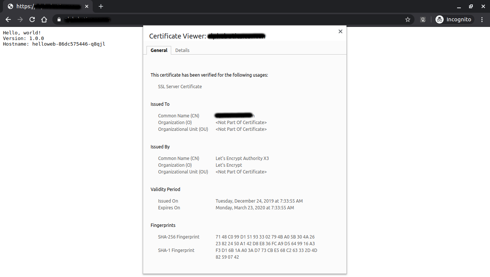

# Configuring Domain Names with Static IP Addresses on Kubernetes example

Step 1: Deploy your web application

```shell
kubectl apply -f helloweb-deployment.yaml
```

## Step 2: Expose your application

We will expose your application using an Ingress, which creates an HTTP(S) Load Balancer, it must reserve a global **static IP address**. Regional IP addresses do not work with Ingress.

2.1. To create a global static IP address

    ```shell
    kubectl apply -f global-static-ip-address.yaml
    ```

2.2. Apply the helloweb-ingress.yaml manifest file to the cluster:

```shell
kubectl apply -f helloweb-ingress.yaml
```


To see the reserve IP address associated with the load balancer:

```shell
kubectl get ingress
```

Output

```shell
NAME       HOSTS     ADDRESS          PORTS     AGE
helloweb   *         203.0.x.x     80        4m
```

## Step 3: Config DNS record for domain

1. Open Network services -> Cloud DNS and add your domain.

2. Point domain DNS from DNS provider to these DNS:

    ```
    ns-cloud-d1.googledomains.com
    ns-cloud-d2.googledomains.com
    ns-cloud-d3.googledomains.com
    ns-cloud-d4.googledomains.com
    ```
3. Config A record to point IP address you see above:

    Example:

    ```
    DNS name                Type    TTL         Data

    example.com.	    A	    300	            203.0.x.x
    www.example.com.	A	    300             203.0.x.x
    example.com.	    NS	    21600	
                                                ns-cloud-d1.googledomains.com.
                                                ns-cloud-d2.googledomains.com.
                                                ns-cloud-d3.googledomains.com.
                                                ns-cloud-d4.googledomains.com.
    ...
    ```

4. Check your web site by open your domain on browser: http://example.com

## Step 4: Setup SSL Certificate

Just run this:

```
kubectl apply -f helloweb-ingress-ssl.yaml
```

Check your web site by open your domain on browser: https://example.com



## Reference

https://cloud.google.com/kubernetes-engine/docs/tutorials/configuring-domain-name-static-ip
